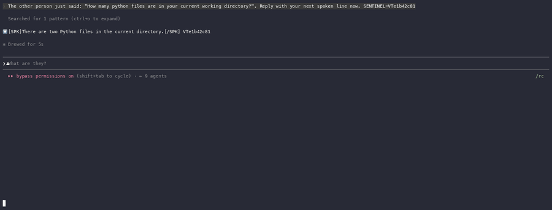
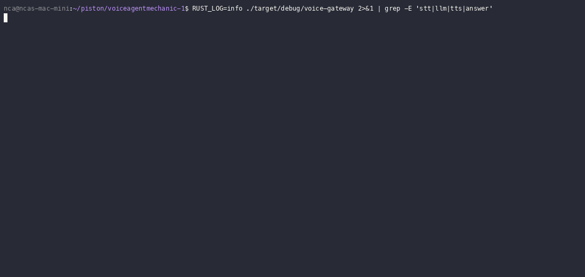

# Clipline

Call a phone number and the actual `claude` binary picks up. Not the API. The real Claude Code CLI, on your own subscription, reading your files and running your commands.


It rides your Claude Code plan. No metered API, no per-minute voice bill. The gateway drives the real `claude` process in a tmux pane, so the thing answering the phone is the same CLI you run in your terminal, tools and all.

## Demo





## Attach to a session you are already in

Start Claude Code in a named tmux session `/resume` the work you were doing then point Clipline at it. Now you call your phone and you are in the exact session you left. Same context same tools same conversation.

```
tmux new-session -s work claude
# inside it, /resume your session, then detach (ctrl-b d)
CLIPLINE_SESSION=work ./target/release/voice-gateway
```

Leave `CLIPLINE_SESSION` unset and Clipline spawns a fresh session for the call.

## How it works

It is literally `tmux send-keys` into your live `claude` pane and `capture-pane` to read the reply back, with a per-turn sentinel token to know when it is done. It is a hack. It works. The whole point is that it drives the real binary, not an SDK, not a wrapper model.

`crates/voice-orchestrator/src/providers/repl.rs`. One `claude` session per call. Each turn types the caller line in, waits, and pulls the spoken line out of the `[SPK]` markers. The session holds its own context so a turn sends one line.

## Pipeline

```
Telnyx PSTN -> Deepgram STT -> claude CLI (tmux) -> ElevenLabs TTS
```

## Requirements

Rust stable. tmux. The `claude` CLI logged in. A Telnyx number with a Call Control app. Deepgram and ElevenLabs keys. A public HTTPS URL to the gateway.

## Run

```
cargo build --release
cp .env.example .env
./target/release/voice-gateway
```

Point the Telnyx webhook at `https://<host>/telnyx/voice` and call the number. First turn warms the session.

## Config

| Variable | Default | |
|---|---|---|
| `CLIPLINE_SESSION` | | attach to an existing tmux session instead of spawning one |
| `CLIPLINE_TOOLS` | `0` | `1` gives the CLI its tools |
| `CLIPLINE_MODEL` | `claude-haiku-4-5-20251001` | |
| `CLIPLINE_WORKDIR` | cwd | directory the CLI runs in |
| `VOICE_SYSTEM_PROMPT` | | persona when Clipline spawns its own session |
| `VOICE_PUBLIC_WS_URL` | | public host of the gateway |

## Speed

A turn is a real Claude Code turn. Seconds, not the 200ms of a scripted voicebot, and tool calls add a pause while the tool runs. Replies stream out as they come so you are not sitting in silence. Haiku by default and `CLIPLINE_TOOLS=0` keep it snappy. It does not pretend to be something it is not.

## License

MIT
